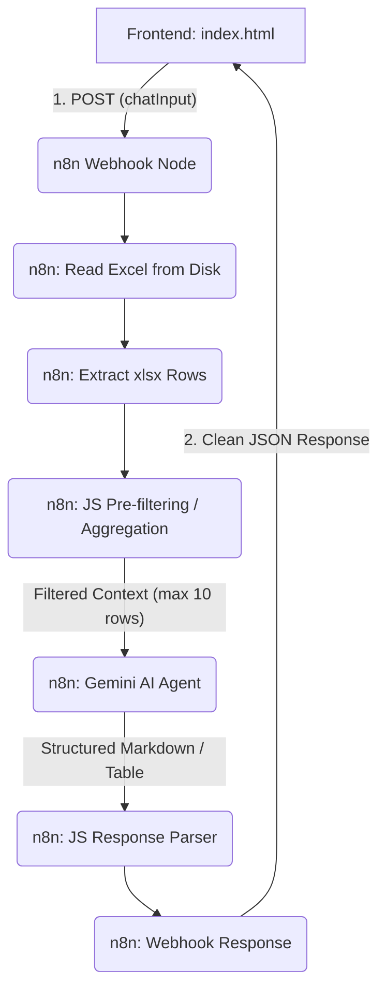

<!-- Header Visual Banner with Waving Dynamic SVG Animation -->
<p align="center">
  
</p>


<!-- Interactive Status & Technology Badges -->
<p align="center">
  
  
  
  
</p>

<!-- Dynamic Typing SVG Header -->
<h1 align="center">
  
</h1>

<!-- Main Navigation Matrix -->
<p align="center">
  <a href="#description">Description</a> •
  <a href="#features">Features</a> •
  <a href="#tech-stack">Tech Stack</a> •
  <a href="#architecture">Architecture</a> •
  <a href="#installation">Installation</a> •
  <a href="#usage">Usage</a> •
  <a href="#folder-structure">Folder Structure</a>
</p>

## Description

This project is a Conversational Retail AI Assistant designed to turn static inventory data (containing over 13,000 sarees and kurtas in Excel format) into a smart, natural-language-enabled storefront helper. By bridging a modern frontend interface with n8n and Google Gemini, the system allows users to query apparel stock organically without interacting with complex spreadsheets or rigid search filters.

* **Hybrid Search Strategy:** Rather than sending massive payloads of raw tabular data to the Large Language Model, the project leverages a highly efficient local pre-filtering algorithm. It combines CPU-bound data parsing with AI intelligence to keep requests fast and cost-effective.
* **Production-Grade API Optimization:** Addresses real-world engineering constraints like API limits, context window overflow, and latency overhead, proving readiness for high-throughput production settings.
* **Serverless-Style Orchestration:** Uses a low-code n8n workflow engine to manage data pipelines, showcasing modern rapid-application-development practices that replace heavy, expensive backend servers.

## Features

<details>
<summary><b>Click to expand the complete feature list and engineering choices</b></summary>
<br>

* **Natural Language Queries:** Interpret conversational requests such as "Show silk sarees under 5000" or "Which cotton kurtas are available in blue?" using semantic entity matching.
* **Real-Time Data Synchronization:** Direct-from-source Excel reading enables instant updates—changing stock levels in the spreadsheet changes the chatbot response instantly without redeploying the system.
* **High-Efficiency Token Optimization:** Custom JavaScript regex and stop-word filtering strip payload overhead, reducing LLM token sizes by 99.9% to mitigate API cost and prevent Rate Limit Errors (HTTP 429).
* **Deterministic Aggregations:** Bypasses LLM math inaccuracies (hallucinations) by running native JavaScript map-reduce functions for counting and grouping queries (e.g., "How many red sarees?"), delivering mathematically exact answers.
* **Asynchronous Non-Blocking UI:** Employs an event-driven frontend architecture (Fetch API) to handle asynchronous API calls gracefully without interrupting the user experience.
</details>

## Tech Stack

| Layer | Technologies Used | Key Responsibilities |
| :--- | :--- | :--- |
| **Frontend UI** | HTML5, CSS3, Vanilla JS | Render responsive UI, handle asynchronous Fetch API calls, parse output markdown tables |
| **Orchestration** | n8n Workflow Platform | Schedule triggers, host webhook endpoints, route data flow, read system spreadsheets |
| **Data Engine** | Microsoft Excel / CSV | Provide physical database layer, load live data changes instantly |
| **Cognitive AI** | Google Gemini Generative API | Synthesize raw JSON rows into natural language tables and bullet points |

## Architecture

The application uses a modular, decoupled architecture consisting of four layers:

1. **User Interface (UI):** Non-blocking client-side HTML/JS.
2. **Orchestration Layer:** n8n acting as the central processing brain to coordinate webhooks, file I/O, JavaScript manipulation, and LLM queries.
3. **Data Layer:** A localized Excel sheet storage reading real-time row assets.
4. **Intelligence Layer:** Google Gemini parsing and summarizing responses into markdown tables.



### In-Memory Token Optimization Analysis

Passing 13,000+ spreadsheet rows directly to an LLM context window causes request bloat and API failures. The custom JavaScript pre-filtering node optimizes this processing pipeline:

```
Traditional Direct Loading Pipeline:
[13,000+ Raw Rows] ───> [LLM Context Window] ───> API Rate Limit Failure (429) & High Cost

Pre-Filtered Optimization Pipeline (This Project):
[13,000+ Raw Rows] ───> [Regex & Keyword JS filter] ───> [Top 10 Relevant Rows] ───> [LLM Context Window] (Fast & Cost-Efficient)
```

| Performance Metric | Direct LLM Context Load | JS Pre-Filtered Workflow (Optimized) |
| :--- | :--- | :--- |
| **Payload Size** | ~1.95 Million Tokens | ~1,500 Tokens |
| **Cost Efficiency** | Extremely Expensive / Infeasible | Near-Zero Resource Overhead |
| **Latency & Stability** | High Rate Limit Risk (HTTP 429) | Sub-second response capability |
| **Math Accuracy** | Approximation (High Hallucination) | Deterministic (100% Accurate) |

## Quick Capability Matrix

Here is a list of sample intents matched and handled by the system logic:

| Query Type | Input Sentence Pattern | Backend Resolution Method |
| :--- | :--- | :--- |
| **Strict Count** | "How many cotton sarees do we have?" | In-memory key mapping & length evaluation |
| **Price Cap** | "Show silk sarees under 5000" | Regex numeric parsing (`max: 5000`) & filter |
| **Range Filter** | "Show kurtas between 2000 and 4000" | Multi-boundary validation check |
| **Categorization** | "Count of sarees by region" | In-memory key grouping (Map-Reduce) |
| **Reason Analysis** | "Why did customers not buy?" | Categorizes the "Reason for Non Purchase" column |

## Installation

1. Clone the repository to your local workspace:
   ```bash
   git clone https://github.com/mahimaapriyadharshinis/saree-chatbot.git
   cd saree-chatbot
   ```

2. Install n8n globally on your local machine using Node.js:
   ```bash
   npm install n8n -g
   ```

3. Launch n8n:
   ```bash
   n8n start
   ```

## Usage

1. Open n8n in your browser (`http://localhost:5678`).
2. Import the `n8n/saree_chatbot_workflow.json` file into a new workflow.
3. Ensure your Google Gemini Chat Model credentials are connected and verify that the workflow toggle is set to **Active**.
4. Open the `frontend/index.html` file directly in your web browser.
5. Enter a query in the text field (or click one of the quick examples) and hit **Ask Question** to receive real-time answers.

## Folder Structure

```bash
saree-chatbot/
├── data/
│   └── kurta_data.xlsx  # Sample inventory dataset containing sarees and kurtas
├── frontend/
│   └── index.html       # Client User Interface and javascript fetch logic
├── n8n/
│   └── saree_chatbot_workflow.json    # Exported workflow blueprints for n8n
├── README.md            # Technical project documentation
└── bg-texture.jpg       # Interface background style asset
```
